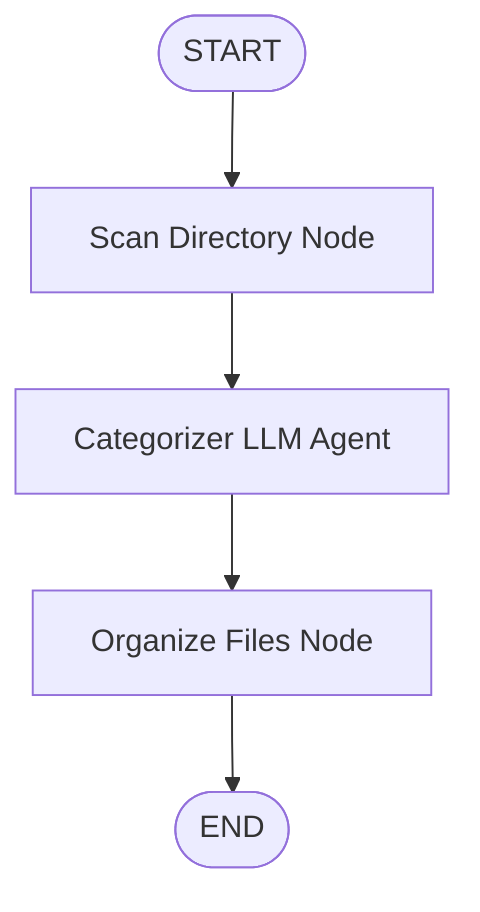

# Neaty Assistant Skill

This skill provides guidelines and quick-reference instructions for developing, testing, and running **Neaty Agent** in this repository.

## 1. Neaty Agent Architecture

Neaty is built on the **Google Agent Development Kit (ADK) 2.0** framework. It uses a graph-based workflow to scan, categorize, and organize files:



- **Scan Directory Node**: A deterministic Python function that scans the target folder, skips ignored folders (like `.venv`, `.git`), and generates a list of files with small content snippets or metadata.
- **Categorizer LLM Agent**: A generative agent utilizing the Gemini API to intelligently group files into elegant, descriptive categories.
- **Organize Files Node**: A deterministic function that safely moves/copies categorized files into their respective folders and writes an `ORGANIZATION_REPORT.md` summary.

---

## 2. Running Neaty Agent Locally

To execute the agent via the terminal:

```bash
# Run on the current directory and save to organized_output
python neaty_agent.py

# Run on a custom source directory and save to a custom destination
python neaty_agent.py --source C:\path\to\source --dest C:\path\to\destination
```

---

## 3. Running the Local Web UI Playground

To interact with the agent in the browser-based ADK Playground, launch the FastAPI web server:

```bash
# Start ADK Web playground pointing to the project directory
adk web .
```

- The playground will be accessible locally at: **`http://127.0.0.1:8000`**
- It relies on the `agent.py` entrypoint, which links the `app` instance from `neaty_agent.py`.

---

## 4. Linting and Code Quality

Always run code quality checks before pushing changes or submitting pull requests:

```bash
# Run comprehensive linter checks (excluding 'ty' type checking)
agents-cli lint --skip-ty

# Automatically fix fixable formatting and lint issues
agents-cli lint --fix
```

---

## 5. Troubleshooting

- **Gemini API Key missing**: Ensure `GEMINI_API_KEY` is present in your `.env` file or environment.
- **Linter / uv Sync failures**: Ensure a valid `pyproject.toml` is present in the workspace root with standard dependencies configured.
