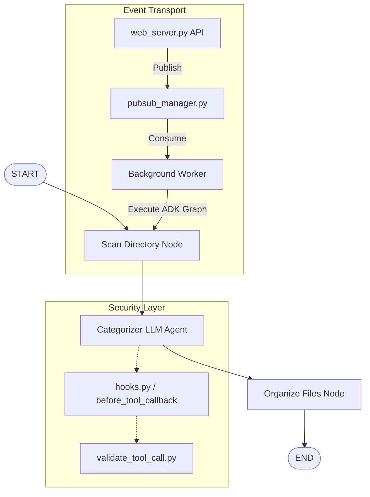

# Context: Neaty File Organizer

## 1. System Overview
Neaty File Organizer is an intelligent, automated directory management application built on Google ADK 2.0. It leverages Gemini-powered, graph-based workflows to scan messy local files, intelligently classify them into highly descriptive folders, and safely organize them while keeping original files intact.

## 2. Architecture
- **Components:**
  - `Scan Directory Node`: A deterministic node that scans user directories, filters out system/ignored folders, and extracts text snippets.
  - `Categorizer LLM Agent` (`neaty_categorizer`): A Gemini-2.5-flash agent equipped with a custom ADK Skill that designs premium, elegant folder structures.
  - `Safe Organize Files Node`: A deterministic node that replicates files into designated directories and generates an `ORGANIZATION_REPORT.md` summary.
- **Communication:** Dual-mode Pub/Sub model. Real-time tasks are published to Google Cloud Pub/Sub when running on GCP, falling back to a thread-safe asyncio/in-memory local queue when running locally.
- **Data stores:** Local Filesystem (no database required; fully private and local).



## 3. Key Files & Responsibilities
- `pubsub_manager.py`: Manages the application's task message queue. Connects to real Google Cloud Pub/Sub in production, or gracefully falls back to an in-memory queue locally with zero configuration.
- `hooks.py`: Implements `security_before_tool_callback` which intercepts every tool execution in the workflow graph, validates all tool parameters, and halts or modifies execution in case of safety violations.
- `validate_tool_call.py`: Implements regular expressions and security rules to block command execution, catch prompt injections, and redact sensitive PII in-place.
- `neaty_agent.py`: Holds schema validation schemas, deterministic workflow nodes, and the CLI execution driver.
- `web_server.py`: Hosts the local playground API (FastAPI), manages the sync-over-async Pub/Sub web gateway, and serves the Web UI playground located in `static/`.
- `test_security.py`: The test-driven development (TDD) unit test suite.
- `my-skill/SKILL.md`: The ADK 2.0 custom skill providing classification and folder naming guidelines.
- `.pre-commit-config.yaml`: Sets up pre-commit hooks including general file cleanup and Semgrep security scanning.
- `rules.yaml`: Defines custom static security rules used by Semgrep to scan Python files before commits.

## 4. Development Process
### TDD Plan
- Write failing test → confirm failure → implement → confirm pass → refactor
- Test types required: Unit tests (`test_security.py`) covering all security rules and argument validation.
- Definition of "done": All unit tests pass with `OK`, zero skipped tests, and complete python file compilation with zero syntax errors.

### Pre-commit Remediation Loop
- Hooks run: File yaml syntax checks, end of file formatting, trailing whitespace cleanup, and static Semgrep security scanning checks (via `.pre-commit-config.yaml` and `rules.yaml`).
- On failure: Runs auto-formatting/fixers; halts and reports error if a Semgrep rule flags a safety violation (like `subprocess` or `rm` commands in the codebase) for manual fix.
- Max retry attempts before halting: 3


## 5. Runtime Security Constraints

- **No shell execution:** Agent MUST NOT execute shell commands (subprocess, os.system, exec) via any tool call. Enforced in: `validate_tool_call.py::validate_command_safety`. Exceptions: None.
- **No file content modification:** Agent MUST NEVER touch, edit, truncate, or overwrite the contents of any user file. All organizing must be completely non-destructive (read-only for indexing and copy/move-based for organization). Enforced in: `my-skill/SKILL.md::Non-Destructive Integrity Rule` and `neaty_agent.py::organize_files_node` (using safe metadata-preserving `shutil.copy2` operations).
- **Tool input validation:** All tool calls validated for schema type matching, prompt injection patterns, and PII before execution. Enforced in: `hooks.py::security_before_tool_callback` (invoking `validate_tool_call.py::validate_arguments`). On failure: The tool execution is blocked and intercepted; a safe security-blocked response payload is returned back to the agent runner instead of executing.
- **Prompt injection defenses:** Scans and blocks tool arguments containing typical override phrases (e.g., "ignore previous instructions", "system override", "you are now a", "jailbreak"). Enforced in: `validate_tool_call.py::detect_prompt_injection`.
- **PII handling:** Scans and redacts Credit Cards, Social Security Numbers (SSN), Emails, and Phone Numbers. Detected PII is replaced with redacted placeholders (e.g., `[EMAIL_REDACTED]`) in-place. Enforced in: `validate_tool_call.py::detect_and_redact_pii`.


## 6. How to Run Tests
```bash
.venv/Scripts/python -m unittest test_security.py
```

## 7. Known Limitations / Open Questions
- Categorization is guided by LLM heuristics; extreme file naming combinations might occasionally land files in generic or "Miscellaneous" categories.
- Binary and media files are evaluated using only extension metadata and size; reading binary file content is skipped to conserve LLM context window tokens.

## 8. References
- [ADK Assistant Developer Skill](file:///C:/Users/SAGHAR/Desktop/neaty/.agents/skills/neaty-assistant/SKILL.md)
- [README_DOCKER.md Container Guide](file:///C:/Users/SAGHAR/Desktop/neaty/README_DOCKER.md)
